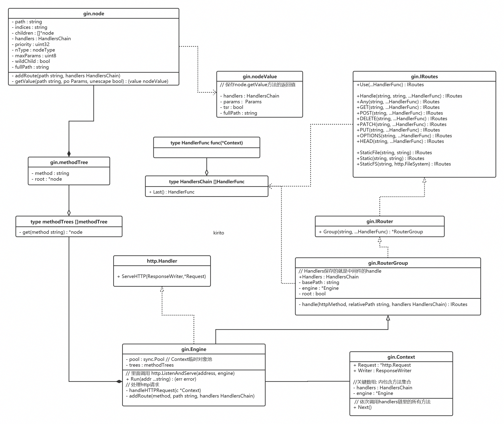

## 1 安装

```bash
$ go get -u github.com/gin-gonic/gin
```

* 使用`http.StatusOK`之类的常量，要引入`net/http`包


## 2 使用

官方文档：[https://gin-gonic.com/zh-cn/docs](https://gin-gonic.com/zh-cn/docs)


官方例子：[https://github.com/gin-gonic/examples](https://github.com/gin-gonic/examples)


## 3 框架分析

```go
r := gin.New()
```





### 3.1 从`r.Run()`出发

`gin.Engine` 就是整个框架的类：

```go
r.Run(":8080")
func (engine *Engine) Run(addr ...string) (err error) { // 参数是监听地址
	defer func() { debugPrintError(err) }()

	address := resolveAddress(addr)
	debugPrint("Listening and serving HTTP on %s\n", address)
	err = http.ListenAndServe(address, engine) // 重点在这里
	return
}
```

`gin.Engine`实现了`net/http`包的接口

```go
type Handler interface {
	ServeHTTP(ResponseWriter, *Request)
}
```

跳转到`gin.Engine.ServeHTTP`函数：

```go
func (engine *Engine) ServeHTTP(w http.ResponseWriter, req *http.Request) {
	c := engine.pool.Get().(*Context)
	c.writermem.reset(w)
	c.Request = req
	c.reset()

	engine.handleHTTPRequest(c) // 这个函数里实现了对具体请求的处理

	engine.pool.Put(c)
}
```

`gin.Context`也是框架里一个重要的数据结构。


继续往里跳：

```go
func (engine *Engine) handleHTTPRequest(c *Context) {
	// ...

	// Find root of the tree for the given HTTP method
	t := engine.trees
	for i, tl := 0, len(t); i < tl; i++ {
		if t[i].method != httpMethod {
			continue
		}
		root := t[i].root
		// Find route in tree
        // getValue 返回给定路径上注册的handle 路由匹配算法在这个函数实现
		value := root.getValue(rPath, c.Params, unescape)
		if value.handlers != nil {
			c.handlers = value.handlers
			c.Params = value.params
			c.fullPath = value.fullPath
			c.Next() // 注意这个函数一般只在中间件中调用，依次调用注册的函数
			c.writermem.WriteHeaderNow()
			return
		}
        // 没匹配到路由的处理 ...
		// ...
}
```

`root`的类型是`gin.node`，跳到`node.getValue`方法：

```go
func (n *node) getValue(path string, po Params, unescape bool) (value nodeValue){
    //.. 这个函数通过path匹配路由，把路由上注册的方法通过 nodeValue 结构体返回
}
```

从这个方法返回到`handleHTTPRequest`后，把`nodeValue`的值给`Context`，然后调用`Context.Next()`执行用户注册的函数


### 3.2 从`r.GET()`出发


```go
r.GET("/ping", func(c *gin.Context) {
    c.String(http.StatusOK, "pong")
})

func (group *RouterGroup) GET(relativePath string, handlers ...HandlerFunc) IRoutes {
	return group.handle(http.MethodGet, relativePath, handlers)
}
```

由此可见，`gin.Engine`继承了`gin.RouterGroup`

```go
type RouterGroup struct {
	Handlers HandlersChain
	basePath string
	engine   *Engine
	root     bool
}
```

而`gin.RouterGroup`又实现了`IRouter`接口，进而实现`IRoutes`接口：

```go
type IRouter interface {
	IRoutes
	Group(string, ...HandlerFunc) *RouterGroup
}

type IRoutes interface {
	Use(...HandlerFunc) IRoutes

	Handle(string, string, ...HandlerFunc) IRoutes
	Any(string, ...HandlerFunc) IRoutes
	GET(string, ...HandlerFunc) IRoutes
	POST(string, ...HandlerFunc) IRoutes
	DELETE(string, ...HandlerFunc) IRoutes
	PATCH(string, ...HandlerFunc) IRoutes
	PUT(string, ...HandlerFunc) IRoutes
	OPTIONS(string, ...HandlerFunc) IRoutes
	HEAD(string, ...HandlerFunc) IRoutes

	StaticFile(string, string) IRoutes
	Static(string, string) IRoutes
	StaticFS(string, http.FileSystem) IRoutes
}
```


继续看`GET()`做了什么，跳进去：

```go
// 把handler注册到给定方法和路径的路由上
func (group *RouterGroup) handle(httpMethod, relativePath string, handlers HandlersChain) IRoutes {
	absolutePath := group.calculateAbsolutePath(relativePath)
	handlers = group.combineHandlers(handlers)
	group.engine.addRoute(httpMethod, absolutePath, handlers) // 重点
	return group.returnObj()
}
```

继续跳：

```go
// 放到路由树上
func (engine *Engine) addRoute(method, path string, handlers HandlersChain) {
	// ...
	debugPrintRoute(method, path, handlers)
	root := engine.trees.get(method)
	if root == nil {
		root = new(node)
		root.fullPath = "/"
		engine.trees = append(engine.trees, methodTree{method: method, root: root})
	}
	root.addRoute(path, handlers)
}
```

至此成功注册了一个`GET`方法下的路由


### 3.3 从`r.Group r.Use`出发

```go
newGroup := r.Group("/")

func (group *RouterGroup) Group(relativePath string, handlers ...HandlerFunc) *RouterGroup {
	return &RouterGroup{
		Handlers: group.combineHandlers(handlers), // 中间件
		basePath: group.calculateAbsolutePath(relativePath),
		engine:   group.engine,
	}
}
```

很简单，就是创建了一个`RouterGroup`对象返回


再来看`r.Use`

```go
r.Use(gin.Logger())
func (engine *Engine) Use(middleware ...HandlerFunc) IRoutes {
	engine.RouterGroup.Use(middleware...) // 中间件是被注册到 RouterGroup 对象上的
	engine.rebuild404Handlers()
	engine.rebuild405Handlers()
	return engine
}
```

继续跳：

```go
func (group *RouterGroup) Use(middleware ...HandlerFunc) IRoutes {
	group.Handlers = append(group.Handlers, middleware...)
	return group.returnObj()
}
```

由此可见，`RouterGroup.Handlers` **保存的就是中间件的handle**


注册一个中间件非常简单，下面会说当请求来到时，中间件如何与用户注册的handle一起被执行


### 3.4 请求过程

中间件和用户注册的路由handle是如何被执行的？


现有`RouterGroup`，再有注册中间件，然后才有用户注册路由，前两个上面说了，代码很简单


所以还是从`r.GET()`出发，再看一遍

```go
r.GET("/ping", func(c *gin.Context) {
    c.String(http.StatusOK, "pong")
})

func (group *RouterGroup) GET(relativePath string, handlers ...HandlerFunc) IRoutes {
	return group.handle(http.MethodGet, relativePath, handlers)
}

func (group *RouterGroup) handle(httpMethod, relativePath string, handlers HandlersChain) IRoutes {
	absolutePath := group.calculateAbsolutePath(relativePath)
	handlers = group.combineHandlers(handlers) // 重点
	group.engine.addRoute(httpMethod, absolutePath, handlers) // 添加路由
	return group.returnObj()
}
```

一路跳到`RouterGroup.handle` 里的`group.combineHandlers(handlers)`

```go
// 这个函数把用户注册的handle和中间件的handle组合起来并返回
func (group *RouterGroup) combineHandlers(handlers HandlersChain) HandlersChain {
	finalSize := len(group.Handlers) + len(handlers)
	if finalSize >= int(abortIndex) {
		panic("too many handlers")
	}
	mergedHandlers := make(HandlersChain, finalSize)
	copy(mergedHandlers, group.Handlers)
	copy(mergedHandlers[len(group.Handlers):], handlers)
	return mergedHandlers
}
```

到这里就很明确了，中间件的handle和用户注册的handle被一起放进了路由树里，中间件在前，用户注册在后


然后再从`r.Run`来看：

```go
func (engine *Engine) Run(addr ...string) (err error) {
	// ... 
	err = http.ListenAndServe(address, engine)
	return
}

// Engine实现了http.Handler接口，当请求过来时，会调用如下函数
func (engine *Engine) ServeHTTP(w http.ResponseWriter, req *http.Request) {
	c := engine.pool.Get().(*Context)
	c.writermem.reset(w)
	c.Request = req
	c.reset()

	engine.handleHTTPRequest(c)

	engine.pool.Put(c)
}

func (engine *Engine) handleHTTPRequest(c *Context) {
	// ...
    
	// Find root of the tree for the given HTTP method
	t := engine.trees
	for i, tl := 0, len(t); i < tl; i++ {
		if t[i].method != httpMethod {
			continue
		}
		root := t[i].root
		// Find route in tree
		value := root.getValue(rPath, c.Params, unescape) // 拿到路由上注册的函数
		if value.handlers != nil {
			c.handlers = value.handlers
			c.Params = value.params
			c.fullPath = value.fullPath
			c.Next() // 调用所有
			c.writermem.WriteHeaderNow()
			return
		}
        // ...
}
```

中间件的handle和用户注册的handle被一起放进了路由树里，所以获取的时候也是一起被获取的


然后在`Context.Next`里被按照先后顺序调用


完