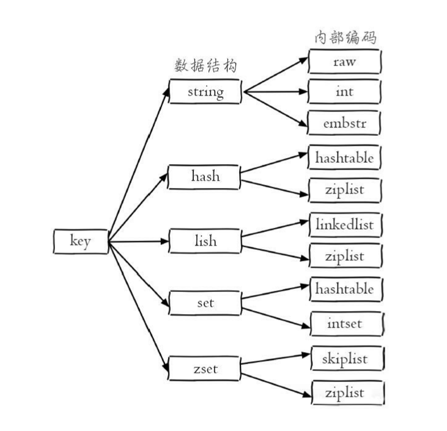

# Redis操作手册

* [官网](https://redis.io)
* redis是单线程事件驱动
* redis没有命名空间概念，可通过`key`的名字自由发挥

## 1 安装

### 1.1 linux上安装

* ubuntu

```bash
$ sudo apt install redis-server
```

配置文件位于：`/etc/redis/redis.conf`


配置文件中放开`requirepass`的注释可以设置密码，有密码时连接要认证`redis-cli -a passwd`


注释掉`bind 127.0.0.1 ::1`，允许外部连接


redis默认端口：`6379`


## 2 使用

连接`redis-server`可以使用自带客户端`redis-cli`，或者某种语言的`api`


```bash
$ redis-cli -h
redis-cli 4.0.9

Usage: redis-cli [OPTIONS] [cmd [arg [arg ...]]]
  -h <hostname>      Server hostname (default: 127.0.0.1).
  -p <port>          Server port (default: 6379).
  -s <socket>        Server socket (overrides hostname and port).
  -a <password>      Password to use when connecting to the server.
  -x                 Read last argument from STDIN.
  -n <db>            Database number.
```

### 2.1 全局命令

直接在`redis-cli`执行可以看到结果：


* 查看所有键 -  `keys *`
  * 输出所有键值对，慎用
* 键总数 - `dbsize`
  * 无需遍历，这是个`O(1)`的操作
* 检查键是否存在 - `exists key`
  * 存在返回1，不存在返回0
* 删除键 - `del key`
  * 通用命令，什么数据类型都可以删，可以跟多个`key`一次删除
  * 返回成功删除的个数，不存在的键不计数
* 设置过期 - `expire key seconds`
  * 设置`seconds`秒后删除`key`，设置成功返回1
  * `ttl key` 返回剩余时间，大于`0`表示声音时间，`-1`表示没设置超时，`-2`键不存在
* 数据类型 - `type key`
  * 返回`key`中的数据类型，不存在返回`none`
  * 数据类型有`string`,`hash`,`list`,`set`,`zset`
* 内部编码 - `object encoding key`
  * 每种数据类型都有多种内部实现方式，查询`key`的内部实现



### 2.2 字符串

* 设置值

  ```txt
  set key value [ex seconds] [px milliseconds] [nx|xx]
  ```

  * `ex seconds` - 选项，设置秒级过期时间
  * `px milliseconds` - 设置毫秒级过期时间
  * `nx` - 键必须不存在，才能设置成功，用于添加
  * `xx` - 键值必须存在，用于更新

* 获取值

  ```txt
  get key
  ```

  * 如果键不存在，返回`nil`

* 批量设置值

  ```cpp
  mset key value [key value ...]
  ```

* 批量获取值

  ```txt
  mget key [key ...]
  ```

  * 如果有些键不存在，值为`nil`

* 计数，增加值(string的实现必须是int),自减

  ```txt
  incr key		 	// +1
  decr key 			// -1
  incrby key n 		// +n
  decrby key n 		// -n
  incrbyfloat key n.m // +n.m 浮点数  内部实现是 embstr
  ```

  * 值不是整数，返回错误
  * 值是整数，返回自增后的结果
  * 键不存在，按照值为0自增

* 追加

  ```txt
  append key value
  ```

  * 向字符串尾部拼接值，返回拼接后长度
  * 如果键不存在，当成向空字符串后拼接

* 获取长度

  ```txt
  strlen key
  ```

  * 键不存在返回0

* 设置并返回原值

  ```txt
  getset key value
  ```

  * 设置新值，把原来的值返回
  * 键不存在，返回`nil`

* 设置指定位置字符

  ```txt
  setrange key offeset value
  ```

  * 把`key`里面的字符串偏移`offeset`的位置的字符设置为`value`
  * 长度超出，填充`0x00`, 键不存在按空串处理

* 获取部分字符串

  ```txt
  getrange key start end
  ```

  * 返会落在范围内的字符，范围大只返回实际有的字符串
  * 键不存在当空串处理，范围多大都返回`""`


#### 2.2.1 内部编码

* `int` - 8字节长整型(有符号)
* `embstr` - 小于等于39个字节的字符串
* `raw` - 大于39个字节的串


### 2.3 哈希

哈希类型是指键值本身又是一个键值对结构


形如`value = { {field1，value1}, ...{fieldn,valuen} }`


* 设置值

  ```txt
  hset key field value
  hset user:1 name kirito
  ```

  * 向键值为`key`的字典中加入一个键值对
  * 成功返回1，否则0
  * 提供了`hsetnx`命令，用于添加

* 获取值

  ```
  hget key field
  ```

  * 不存在返回`nil`

* 删除field

  ```txt
  hdel key field [field ...]
  ```

  * 返回成功删除的个数

* 计算field个数

  ```txt
  hlen key
  ```

  * 不存在返回0，键的内容不是哈希返回错误信息

* 批量设置，获取 field-value

  ```txt
  hmget key field [field ...]
  hmset key field value [field value ...]
  ```

* 判断field是否存在

  ```txt
  hexists key field
  ```

* 获取所有field

  ```txt
  hkeys key
  ```

  * 这个命令应该叫`hfields`更为恰当

* 获取所有value

  ```txt
  hvals key
  ```

* 获取所有的 field-value

  ```txt
  hgetall key
  ```

  * 如果数量多，慎用
  * 如果一定要获取全部field-value，可以使用`hscan`命令

* value自增

  ```txt
  hincrby key field n
  hincrbyfloat key field n.m
  ```

  * 像`incrby`和`incrbyfloat`命令一样，但是它们作用的是filed

* 计算value的字符串长度（3.2版本以上）

  ```txt
  hstrlen key field
  ```

  


#### 2.3.1 内部编码

* `ziplist` - 压缩列表，紧凑的结构实现多个元素的连续存储，所以在节省内
  存方面比hashtable更加优秀，元素少的时候用这个
* `hashtable` - 哈希表


### 2.4 列表

一个列表最多可以存储$2^{32} -1$个元素。可以对列表两端插入（push）和弹出（pop），还可以获取指定范围的元素列表、获取指定索引下标的元素等


| 操作类型 |          操纵          |
| :------: | :--------------------: |
|   添加   | `rpush lpush linsert`  |
|   查询   | `lrange lindex  llen`  |
|   删除   | `lpop rpop lrem ltrim` |
|   修改   |         `lset`         |
| 阻塞操作 |     `blpop brpop`      |

#### 2.4.1 添加操作


* 从右边插入(向后插入)

  ```
  rpush key value [value ...]
  ```

  * 返回插入后列表元素个数

* 从左边插入(向前插入)

  ```
  lpush key value [value ...]
  ```

  * 返回插入后元素个数

* 向某个元素前或后插入元素

  ```cpp
  linsert key before|after pivot value
  ```

  * 找到等于`pivot`的元素，在其前或后插入`value`
  * 返回插入后长度
  * `pivot`不存在返回`-1`，不插入

* 获取指定范围元素

  ```
  lrange key start end
  ```

  * `key` 不存在，返回空
  * 区间过大，只返回实际拥有的元素
  * `0`是第一个元素，`-1`是最后一个元素，`-2`是倒数第二个元素，打印所有使用`lrange key 0 -1`

* 获取指定下标的元素

  ```
  lindex key index
  ```

  * 不存在返回`nil`
  * 下标与区间范围一样，可以用负数

* 获取列表长度

  ```
  llen key 
  ```

  * `key`不存在返回0

* 删除，从列表左侧弹出元素（删除列表头）

  ```
  lpop key
  ```

  * 返回被弹出的元素
  * 列表为空或不存在返回`nil`

* 删除，从右侧弹出（删除尾部元素）

  ```
  rpop key
  ```

* 删除指定元素

  ```
  lrem key count value
  ```

  * `count > 0`，从左到右删除，删除最多`count`个等于`value`元素
  * `count < 0`，从右到左删除
  * `count = 0`，删除所有
  * 返回实际删除个数

* 按照索引范围修剪列表

  ```
  ltrim key start end
  ```

  * `[start, end]`范围内的元素保留，其余删除

* 修改指定下标的元素

  ```
  lset key index newValue
  ```

  * 不存在，或超出范围，返回失败信息

* 阻塞式弹出

  ```
  blpop key [key ...] timeout
  brpop key [key ...] timeout
  ```

  * 是`lpop`和`rpop`的阻塞版本，使用方法相同
  * `key` 任意多个键，`timeout` 阻塞时间
  * 一旦有一个`key`可以弹出元素，就立即返回，否则超时返回
  * 某个`key`弹出成功，返回`key`名字和弹出元素，超时返回`nil`和时间
  * 如果多个客户端对同一个键执行`brpop`，那么最先执行命令的客户端可以获取到弹出的值
  * 阻塞可以实现消息队列

#### 2.4.2 内部编码

* `ziplist`
* `linkedlist`
* `quicklist`


### 2.5 集合

集合中不允许有重复元素，并且集合中的元素是无序的，不能通过索引下标获取元素。个集合最多
可以存储$2^{32} -1$个元素，Redis除了支持集合内的增删改查，同时还支持多个集合取交集、并集、差集。


集合可以实现`tag`，比如用户感兴趣的标签

#### 2.5.1 集合内操作

* 添加元素

  ```
  sadd key element [element ...]
  ```

  * 返回成功添加的元素个数

* 删除元素

  ```
  srem key element [element ...]
  ```

  * 返回成功删除的个数

* 返回元素个数

  ```
  scard key
  ```

  * `O(1)`复杂度，不会遍历，有内部变量记录

* 判断元素是否在集合中

  ```
  sismember key element
  ```

  * 存在返回`1`，不存在返回`0`

* 随机从集合返回若干个元素

  ```
  srandmember key [count]
  ```

  * `count`指定返回个数，默认为1，元素如果不够，仅返回全部

* 随机从集合弹出元素

  ```
  spop key [count]
  ```

  * 返回弹出的元素，空集合返回空

* 获取所有元素

  ```
  smembers key
  ```


#### 2.5.2 集合间操作

* 求多个集合的交集

  ```
  sinter key [key ...]
  ```

* 求多个集合的并集

  ```
  sunion key [key ...]
  ```

* 求多个集合的差集

  ```
  sdiff key [key ...]
  ```

* 保存运算结果到新的集合

  ```
  sinterstore destination key [key ...]
  suionstore destination key [key ...]
  sdiffstore destination key [key ...]
  ```

  * 集合操作比较耗时，可以把结果保存到名为`destination`的键中
  * `sinterstore set3 set1 set2`


#### 2.5.3 内部编码

* `intset` - 集合较小且都为整数会用这个
* `hashtable`


### 2.6 有序集合

有序集合中的元素可以排序。但是它和列表使用索引下标作为排序依据不同的是，它给每个元素设置一个分数（score）作为排序的依据。


可以实现排行榜

#### 2.6.1 集合内操作

* 添加(修改)成员

  ```
  zadd key [nx|xx] [ch] [incr] score member [score member ...]  
  zadd key score member [score member ...]
  ```

  * 多个成员分数可以相同，返回成功插入个数
  * `incr` - `score`的意义变为在原有分数上加分，不存在元素分数为`0`, 只支持加入一个，相当于`zincrby`
  * `ch`  - 返回此次操作后，分数发生变化的元素个数，新加入元素也算分数变化
  * `nx` - 元素必须不存在，添加操作
  * `xx` - 元素必须存在，修改操作

* 返回元素个数

  ```
  zcard key
  ```

* 返回某个成员分数

  ```
  zscore key member
  ```

  * 元素不存在返回`nil`

* 计算成员排名

  ```
  zrank key member
  zrevrank key member
  ```

  * `zrank`是从低分到高分排序，`zrevrank`反之
  * 不存在返回`nil`，排名从`0`开始

* 删除成员

  ```
  zrem key member [member ...]
  ```

  * 返回实际删除个数，不存在的元素忽略

* 增加成员的分数

  ```
  zincrby key increment member
  ```

  * 给`member`增加`increment`分，不存在元素初始分当作`0`，返回增加后分数

* 返回指定排名范围的成员

  ```
  zrange key start end [withscores]
  zrevrange key start end [withscores]
  ```

  * `zrange`从低到高排名，`zrevrange`从高到低排序

  * `withscores`同时返回分数

    ```
    127.0.0.1:6379> ZRANGE zset 1 -1 withscores
     1) "cpp"
     2) "2"
     3) "go"
     4) "2"
     5) "incr"
     6) "3"
     7) "mem"
     8) "3"
     9) "mem1"
    10) "3"
    ```

  * `-1`表示最后一名,从`0`开始

* 返回指定分数范围的成员

  ```
  zrangebyscore key min max [withscores] [limit offset count]
  zrevrangebyscore key max min [withscores] [limit offset count]
  
  (min max 表示min用开区间
  min (max 表示max用开区间
  -inf 无限小
  +inf 无限大
  ```

  * `[limit offset count]` - 从`offset`偏移位置输出，输出`count`个，相当于分页查询

* 返回指定分数范围成员个数

  ```
  zcount key min max
  
  也支持开区间 (min (max
  支持无限
  ```

* 删除指定排名内的**升序**元素

  ```
  zremrangebyrank key start end
  ```

  * 删除排名在`[start,end]`的元素
  * 返回删除个数

* 删除指定分数范围的成员

  ```
  zremrangebyscore key min max
  支持开区间，无限
  ```

  * 返回删除个数


#### 2.6.2 集合间操作

* 交集

  ```
  zinterstore destination numkeys key [key ...] [weights weight [weight ...]] [aggregate sum|min|max]
  ```

  * `destination` - 交集计算结果保存到这个键
  * `numkeys` - 需要做交集计算键的个数
  * `key[key...]` - 需要做交集计算的键
  * `weights weight[weight...]` - 每个键的权重，在做交集计算时，每个键中的每个member会将自己分数乘以这个权重，每个键的权重默认是1
  * `aggregate sum|min|max` - 计算成员交集后，分值可以按照sum（和）、min（最小值）、max（最大值）做汇总，默认值是 sum。
  * 返回交集元素个数，结果存在新键中

* 并集

  ```
  zunionstore ...
  和上面其他参数一样
  ```

  


#### 2.6.3 内部编码

* `ziplist`

* `skiplist`

  


### 2.7 键管理


按照单个键、遍历键、数据库管理三个维度对一些**通用命令**进行介绍


#### 2.7.1 单个键管理

* 重命名

  ```
  rename key newkey
  renamenx key newkey
  ```

  * `newkey` - 如果已经存在，会被直接覆盖
  * `renamenx` - 这个命令会检查`newkey`是否存在，不存在才会成功
  * 重命名期间会执行`del`删除旧的键，如果数据量大，时间比较多(阻塞)

* 随机返回一个键

  ```
  randomkey
  ```

* 键过期

  ```
  expire key seconds // 在seconds秒后过期
  expireat key timestamp // 在秒级时间戳timestamp过期
  pexpire key milliseconds // 在毫秒后过期
  pexpireat key milliseconds-timestamp // 在毫秒级时间戳过期
  persist key // 清除过期时间
  ```

  * 以上所有命令内部都是使用`pexpireat`，键不存在返回`0`
  * 如果键不存在，返回`0`，过期时间为负值则立即删除
  * **对于字符串类型的键，`set`命令会取消过期时间**
  * `ttl`和`pttl`都有可以查询键的剩余过期时间，后者毫秒级
    * 返回`>0`，剩余时间
    * `-1`，键没有设置过期时间
    * `-2`，键不存在

* 迁移键

  ```
  move key db  // move命令用于在Redis内部进行数据迁移
  ```

  ```bash
  dump key
  restore key ttl value // ttl存活时间，0为永久
  
  // 直接在cli里使用出来的是个字符串 "\x0b\x16\x02\x00\x...c1*\x8d"
  // 命令行里使用如下
  
  $ redis-cli -a 123456 dump set1 | head -c -1 > file  # 备份，head去掉文件末尾换行符0x0a
  
  $ cat file | redis-cli -a 123456 -x restore newset 0 # 恢复
  ```

  ```
  migrate host port key|"" destination-db timeout [copy] [replace] [keys key [key ...]]
  MIGRATE host port key| destination-db timeout [COPY] [REPLACE] [KEYS key]
  ```

  * `host` 目标`redis`主机，`port`端口
  * `key|""`  -  早期`migrate`只支持迁移一个键，所以此处是要迁移的键，但`Redis3.0.6`版本之后支持迁移多个键，如果当前需要迁移多个键，此处为空字符串`""`
  * `destination-db` - 目标Redis的数据库索引`0 - 15`
  * `timeout` - 迁移的超时时间，毫秒
  * `copy` - 如果添加此选项，迁移后并不删除源键
  * `replace` - 不管目标Redis是否存在该键都会正常迁移进行数据覆盖。
  * `[KEYSkey[key...]]` - 迁移多个键，例如要迁移`key1、key2、key3`，此处填写`keys key1 key2 key3`


#### 2.7.2 遍历键

* 全量遍历键

  ```
  keys pattern 
  ```

  * `*` - 匹配任意个字符，就是遍历所有

  * `\` - 转义

  * `[] [1,3] [1-3]` , 匹配部分字符

  * `?` - 任意字符

  * ```bash
    $ redis-cli keys set\* | xargs redis-cli del
    # 删除所有 set 开头的键, bash里 * 需要转义
    ```

  * 如果耗时，会阻塞其他业务


* 渐进式遍历

  ```
  scan cursor [match pattern] [count number]
  ```

  * `cursor` - 游标，从0开始，每次遍历完返回当前游标值，使用新下标继续遍历，返回0表示遍历结束
  * `match pattern` - 匹配模式
  * `count number` - 要遍历的个数，默认`10`
  * 如果在`scan`的过程中如果有键的变化（增加、删除、修改），那么遍历效果可能会重复，遍历不到


#### 2.7.3 数据库管理

Redis默认配置中是有16个数据库，编号`0 - 15`，默认登录都在`0`号数据库


* 切换数据库

  ```
  select dbIndex
  ```

* 清空数据库

  ```
  flushdb // 清空当前数据库
  flushall // 清空所有
  ```

  

## 3 编程语言中使用

### 3.1 go

```bash
$ go get github.com/garyburd/redigo/redis
```

```go
package main

import (
	"fmt"
	"github.com/garyburd/redigo/redis"
	"os"
	"reflect"
)

func main() {

	c, err := redis.Dial("tcp", "192.168.0.101:6379", )
	if err != nil {
		fmt.Println(err)
		os.Exit(1)
	}
	defer c.Close()

	err = c.Send("auth", "123456")
	if err != nil {
		fmt.Println(err)
		os.Exit(1)
	}

	ret, err := c.Do("set", "testkey", "my name is ??")
	// ret, err := c.Do("set", "testkey", "my name is ??", "EX", 5) 设置超时
	if err != nil {
		fmt.Println(err)
		os.Exit(1)
	}
	fmt.Println(reflect.TypeOf(ret), ret)

	name, err := redis.String(c.Do("get", "testkey"))
	if err != nil {
		fmt.Println(err)
		os.Exit(1)
	}
	fmt.Println(name)

}
/*
string OK
my name is ??
*/
```


